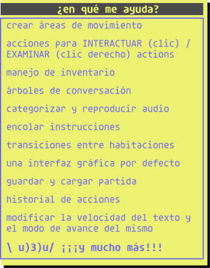
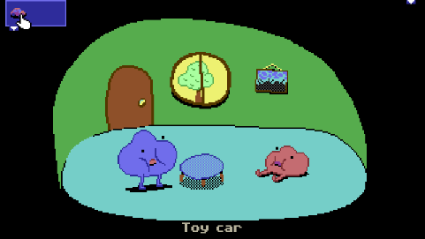
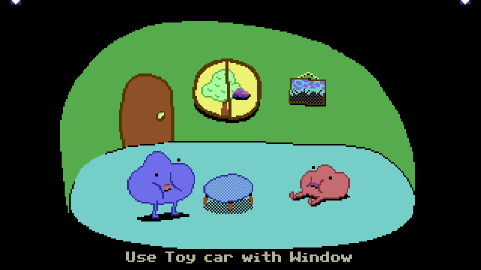
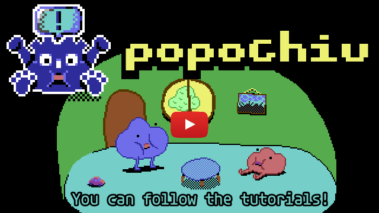

### 🌎 [Read this in English](./README.md) 🌎

Plugin de Godot para crear juegos de aventura gráfica de manera similar a herramientas como [Adventure Game Studio](https://www.adventuregamestudio.co.uk/) y [Power Quest](https://powerhoof.itch.io/powerquest).

---

🔍 Lee la [Documentación](https://github.com/mapedorr/popochiu/wiki) (en progreso) para conocer lo que puedes hacer con el plugin.

❤️ Únete al [Discord de Carenalga](https://discord.gg/Frv8C9Ters) para ver actualizaciones diarias y otras publicaciones

🧠 Revisa el [repositorio de desarrollo](https://github.com/mapedorr/popochiu-dev) para saber acerca de los últimos cambios.

▶️ Sigue los [tutoriales](https://www.youtube.com/playlist?list=PLH0IOYEunrBDz6h4G3vujEmQUZs8vLjz8) (en español) para aprender a usar el plugin.

# ¿Qué es?

Esta herramienta consta de dos partes: el núcleo (Popochiu) y el dock que facilita la creación de los Objetos que hacen uso de dicho núcleo. Está inspirado en como se desarrollan las aventuras gráficas en Adventure Game Studio y en el plugin de Unity de Power Hoof: PowerQuest. Esto es, utilizando Habitaciones (Room) como escenarios donde los Personajes (Character) pueden moverse e interactuar con Props y Hotspots, y proporcionando un sistema de inventario y de gestión de diálogos.

<!--     -->

# Instalación

**Popochiu puede usarse con Godot 3.3.x, 3.4.x. y 3.5.x**

1. [Descarga el ZIP](https://github.com/mapedorr/popochiu/archive/refs/heads/main.zip).
2. Extra su contenido y copia la carpeta `addons` dentro de la carpeta de tu proyecto.
3. Abre tu proyecto en Godot y habilita el plugin Popochiu: `Proyecto > Ajustes del Proyecto > Plugins` (the tab on the top).
4. Reinicia Godot `Proyecto > Volver a Cargar el Proyecto Actual`.
5. Verás el dock de Popochiu a la derecha del editor. ¡Eso es todo!

# Tutoriales

Ahora puedes seguir los tutoriales (¡Completamente en español! (la versión en Inglés la publicaremos pronto)) [en este enlace](https://www.youtube.com/playlist?list=PLH0IOYEunrBDz6h4G3vujEmQUZs8vLjz8). Allí aprenderás:

- Cómo configurar el proyecto.
- Cómo crear habitaciones para que los jugadores puedan caminar y cómo configurarlas si exceden los límites de la ventana del juego.
- Cómo crear personajes y reproducir sus voces cuando hablan.
- Cómo crear Props y Hotspots para interactuar con el entorno.
- Cómo crear elementos de inventario y cómo agregar interacciones entre ellos y las Prop, las Hotspot y los personajes de tu juego.
- Cómo crear árboles de diálogo.
- Cómo agregar efectos de sonido, música, voces y sonidos de interfaz gráfica.

Más tutoriales vendrán en las próximas semanas para aprender:

- Cómo guardar y cargar el estado del juego.
- Cómo trabajar con Props que tienen más de un fotograme.
- Cómo agregar animaciones a tus Personajes.
- Cómo utilizar las emociones cuando los personajes hablan.
- Y mucho más...

---

# Créditos

Hecho por [Carenalga](https://mapedorr.itch.io).
Ahora con la colaboración de [StickGrinder](https://twitter.com/StickGrinder) ([itch.io](https://illiteratecodegames.itch.io))
